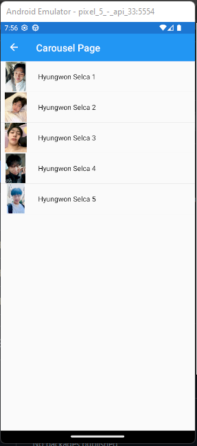

# Module 04 - Exercise 02

## MainPage
[Mainpage.xaml](Module04Navigation/MainPage.xaml)
[Mainpage.xaml.cs](Module04Navigation/MainPage.xaml.cs)

## TabbedPage
[TabbedPage1.xaml](Module04Navigation/TabbedPage1.xaml)
[TabbedPage1.xaml.cs](Module04Navigation/TabbedPage1.xaml.cs)

## CarouselPage
[CarouselPage1.xaml](Module04Navigation/CarouselPage1.xaml)
[CarouselPage1.xaml.cs](Module04Navigation/CarouselPage1.xaml.cs)

## CS FILE
[Hyungwon.cs](Module04Navigation/Hyungwon.cs)
